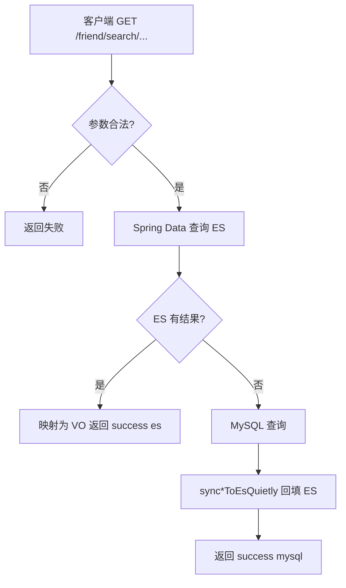
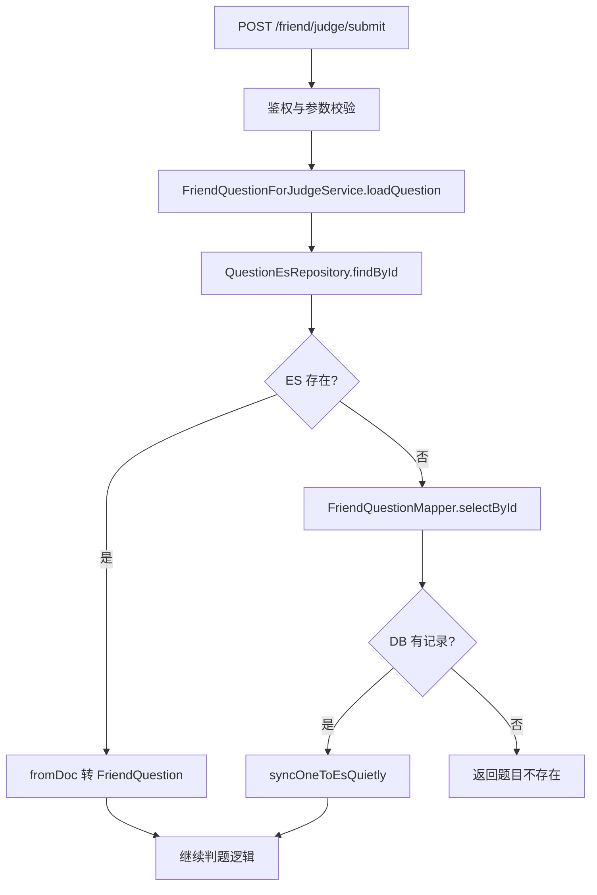

# Elasticsearch 在项目中的使用说明

本文说明 OJ 系统中 **Elasticsearch（ES）** 的定位、涉及接口、数据模型与配置，便于开发与运维对齐。

---

## 1. 用途概览

| 能力 | 说明 |
|------|------|
| **题目/竞赛检索加速** | 用户侧检索 **优先查 ES**；未命中时 **回源 MySQL**，并将结果 **异步回填 ES**（读穿缓存，写失败不影响接口成功）。 |
| **判题前加载题目** | 提交代码判题时 **按 `questionId` 先查 ES**，未命中再查库并 **单条写入 ES**。 |
| **公共组件** | 索引与 `Repository` 定义在 `oj-common-elasticsearch`；`oj-friend` 实际使用；`oj-system` 引入依赖并拉取 Nacos 中的 ES 连接配置（业务侧以测试为主）。 |

技术栈：**Spring Boot 3 + `spring-boot-starter-data-elasticsearch`**（Spring Data Elasticsearch Repository）。

---

## 2. 配置与模块

- **连接配置（Nacos）**：`common-elasticsearch.yaml`（Data ID），键为 `spring.elasticsearch.uris`，默认 `http://127.0.0.1:9200`，可通过环境变量 `ES_URIS` 覆盖。
- **引用服务**：`oj-friend`、`oj-system` 的 `bootstrap.yml` 中 `shared-configs` 包含该 Data ID。
- **代码位置**：
  - 文档与仓储：`oj-common/oj-common-elasticsearch/`
  - 检索与同步：`FriendSearchServiceImpl`
  - 判题读题：`FriendQuestionForJudgeServiceImpl` ← 由 `FriendJudgeServiceImpl` 在提交判题时调用

---

## 3. 涉及 HTTP 接口（经网关前缀以实际部署为准）

### 3.1 检索类（ES 优先 + MySQL 回源）

控制器：`UserSearchController`，基础路径 **`/friend/search`**。

| 方法 | 路径 | 参数 | 行为摘要 |
|------|------|------|----------|
| GET | `/friend/search/question/by-id-like` | `questionId` | 题目 id 关键字模糊 |
| GET | `/friend/search/question/by-title-like` | `title` | 题目标题模糊 |
| GET | `/friend/search/question/by-difficulty` | `difficulty`（0/1/2） | 按难度列表 |
| GET | `/friend/search/exam/by-id-like` | `examId` | 竞赛 id 关键字模糊 |
| GET | `/friend/search/exam/by-title-like` | `title` | 竞赛标题模糊 |

### 3.2 判题类（读题走 ES → MySQL）

控制器：`CodeJudgeController`，基础路径 **`/friend/judge`**。

| 方法 | 路径 | 说明 |
|------|------|------|
| POST | `/friend/judge/submit` | 提交代码；内部 `loadQuestion(questionId)` 先 ES 后 DB |

---

## 4. 流程图示例

### 4.1 检索接口（题目/竞赛通用逻辑）

说明：竞赛与题目分支分别使用 `ExamEsRepository` / `QuestionEsRepository`，但 **“先 ES → 空则 MySQL → 静默写 ES”** 的模式一致。

### 4.2 判题提交读题流程

---

## 5. ES 存储内容（索引与字段）

### 5.1 索引 `oj_question`（文档类 `QuestionDoc`）

| 字段 | 类型（映射） | 含义 |
|------|----------------|------|
| `id` | 文档主键（String） | 与业务表题目 id 一致，字符串避免大整数精度问题 |
| `title` | text | 题目标题 |
| `content` | text | 题目描述/内容 |
| `difficulty` | integer | 难度 0/1/2 |
| `defaultCode` | text | 默认代码模板 |
| `mainMethod` | text | 判题入口方法配置 |
| `questionCase` | text | 测试用例等 |
| `timeLimit` | long | 时间限制 |
| `spaceLimit` | long | 空间限制 |
| `expectedResult` | text | 期望输出 |

**Repository 查询方法（示例）**：`findByIdContaining`、`findByTitleContaining`、`findByDifficulty`。

> 说明：检索接口从 ES 映射到列表 VO 时，当前实现仅透出部分字段（如 id、标题、内容、难度、期望结果等），与列表展示需求一致；**完整题目字段（含用例、时限）在判题读 ES 路径会使用**。

### 5.2 索引 `oj_exam`（文档类 `ExamDoc`）

| 字段 | 类型（映射） | 含义 |
|------|----------------|------|
| `id` | 文档主键（String） | 竞赛 id |
| `title` | text | 竞赛标题 |
| `status` | integer | 状态 0/1/2 |
| `startTime` | keyword | 开始时间（字符串） |
| `endTime` | keyword | 结束时间（字符串） |

**Repository 查询方法（示例）**：`findByIdContaining`、`findByTitleContaining`。

---

## 6. 数据一致性说明

- ES 为 **检索与读题加速层**，**非唯一数据源**；权威数据在 MySQL。
- 管理端若新增/修改题目或竞赛，如未同步写入 ES，用户可能先命中 **旧数据或空**，依赖 **回源 MySQL + 回填** 逐渐补齐；若需强一致，应在管理端增加 **写库同时写 ES / 异步全量同步** 策略（当前代码未统一实现管理端双写，以现有 friend 侧读穿为准）。

---

## 7. 本地与联调建议

1. 启动 ES（如 Docker 映射 `9200`），保证 Nacos 中 `spring.elasticsearch.uris` 可达。
2. 首次检索若索引不存在，Spring Data 可能在首次写入时建索引（视版本与配置而定）；若报错需检查 ES 版本与客户端兼容性。
3. `oj-system` 模块测试类 `ElasticsearchTest` 可用于验证连接与 `QuestionEsRepository` 注入是否正常。

---

## 8. 面试常问：ES 原理与工程（扩展）

本节与 **本项目代码无直接绑定**，便于面试时把「用过 ES」讲清楚：底层在干什么、和数据库差异、常见权衡。

### 8.1 倒排索引（Inverted Index）

- **是什么**：从「词项（term）」指向「包含该词的文档 id 列表」的映射；全文检索时先查词项，再合并文档集合，而不是逐行扫文本。
- **为何快**：适合「关键词/模糊包含类」查询；与本项目中 `title` 等 **text** 字段的 `Containing` 类检索语义一致（具体由分析链与查询类型决定）。
- **对比 MySQL**：InnoDB 以 B+ 树主键/二级索引为主，**全文索引能力与分词、相关性、扩展查询**通常不如 ES 成熟；OJ 场景用 ES 做「题目标题/竞赛名」类检索更自然。

### 8.2 正排与列式存储（Doc Values）

- ES 除倒排外，对排序、聚合等会使用 **doc values**（列存、磁盘友好）；**keyword、数值、日期** 等类型常用于过滤、排序。
- 本项目中竞赛的 `startTime`/`endTime` 使用 **keyword**，偏「原样匹配/展示」，若要做时间范围查询，工程上更常见的是 **date** 类型 + 范围查询。

### 8.3 分析与分词（Analyzer）

- **text** 字段写入/查询前会经 **analyzer**（字符过滤 → 分词 → 词项过滤）；中英文分词器不同，同一句话索引出的 term 列表不同。
- **keyword** 一般 **不分词**，整串作为一个 term；适合 id、枚举、精确过滤。
- 面试可答：**mapping 选 text 还是 keyword 取决于要不要分词检索**。

### 8.4 集群与分片（Shard / Replica）

- **主分片（primary）**：索引数据的分片，数量一般在创建索引时确定，过多过少都影响扩展与单分片体积。
- **副本（replica）**：主分片的拷贝，提升读吞吐与高可用；写入仍经主分片。
- 单机开发常只有一个节点，概念一致即可。

### 8.5 近实时（NRT）

- 写入后默认 **refresh 间隔**（如 1s）内可被搜到，不是严格「写完立刻可见」；与 **MySQL 读已提交** 的语义不同，面试可提一句。

### 8.6 评分与查询类型（简述）

- 全文查询常用 **BM25** 等相关性打分；`match` 与 `term` 区别（是否经分析器）是高频题。
- Spring Data 方法名生成的查询与原生 Query DSL 能力不完全等价，**复杂聚合、高亮、function_score** 往往要写自定义查询。

### 8.7 与「本项目」结合的答法示例

- **为何加 ES**：MySQL 扛模糊检索与扩展搜索成本高；ES 用倒排索引优化「按标题/ id 片段查题、查竞赛」。
- **数据谁为准**：MySQL 为准，ES 为加速层；本项目 **回源 + 回填** 即典型缓存式同步，需能说清 **延迟与一致性的 trade-off**。

### 8.8 其他高频词（点到即可）

- **segment**：底层不可变段，写入增多会 **merge**，影响 IO 与延迟。
- **translog**：写入缓冲与恢复相关。
- **深度分页**：`from/size` 过大性能差，大结果集用 **search_after / scroll**（场景不同）。

---

*文档版本：与仓库当前代码一致；若接口路径随网关调整，以网关路由与 Controller 为准。*
